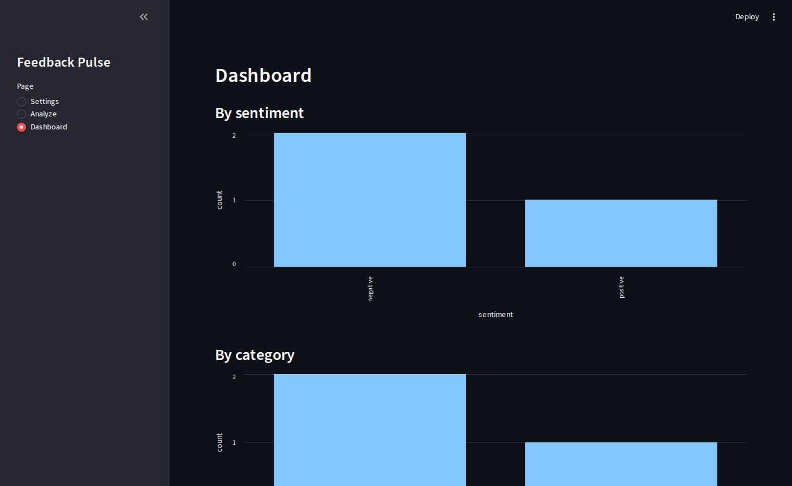

# Feedback Pulse

Classify customer feedback with an OpenAI-compatible LLM (sentiment, category, one-line
summary), store every result in MinIO and Postgres, and watch the trends on a dashboard.
Built with Streamlit as a DKubeX app.



## Pages

- **Settings** — LLM base URL (must end in `/v1`), optional API token, model (fetched from
  `/models` or typed). Saved in the Postgres table `app_settings`; falls back to
  `LLM_BASE_URL`, `LLM_TOKEN`, `LLM_MODEL`.
- **Analyze** — one piece of feedback in; `{sentiment, category, summary}` out. The result is
  written to MinIO (`feedback/<timestamp>_<id>.json`) and to the Postgres table `feedback`.
- **Dashboard** — counts by sentiment and by category, plus the 20 most recent entries.

## Configuration

| Variable | Purpose |
|---|---|
| `DATABASE_URL` | Postgres URL. If unset, `PG_HOST`, `PG_PORT`, `PG_USER`, `PG_PASSWORD`, `PG_DATABASE` |
| `MINIO_ENDPOINT` | `host:port` or `http(s)://host:port` |
| `MINIO_ACCESS_KEY`, `MINIO_SECRET_KEY` | MinIO credentials |
| `MINIO_BUCKET` | Bucket name (default `feedback-pulse`; created if missing) |
| `MINIO_SECURE` | `true` for HTTPS when the endpoint has no scheme |
| `DKUBEX_BASE_PATH` | URL prefix the app is served under (empty = `/`) |
| `DKUBEX_REQUIRE_AUTH` | `true` to reject sessions without the `X-Auth-Request-User` header |

## Run locally

```bash
docker compose up -d                  # Postgres + MinIO, local testing only
set -a; . ./.env.local; set +a
pip install -r requirements.txt
streamlit run app.py
```

## Container image

`ghcr.io/santosh-oc/feedback-pulse:0.2.0` (linux/amd64, linux/arm64), built from the
`Dockerfile`; listens on 8501. While the package is private, install with
`--set imagePullSecrets[0].name=<secret>` pointing at a docker-registry Secret for ghcr.io.

## Helm chart (DKubeX)

The chart is in `charts/feedback-pulse`. It declares `postgres` and `minio` as DKubeX
dependencies (auto-provisioned) and is routed under `/feedback-pulse` through the platform
gateway. The packaged chart is served from the `gh-pages` branch:

```bash
helm repo add feedback-pulse https://santosh-oc.github.io/feedback-pulse
helm install feedback-pulse feedback-pulse/feedback-pulse
```

## In a DKubeX workspace

```bash
d3x app create --name feedback-pulse --display-name "Feedback Pulse" --icon icon.svg
bash run.sh .env.local     # or a file with your own Postgres/MinIO settings
```
